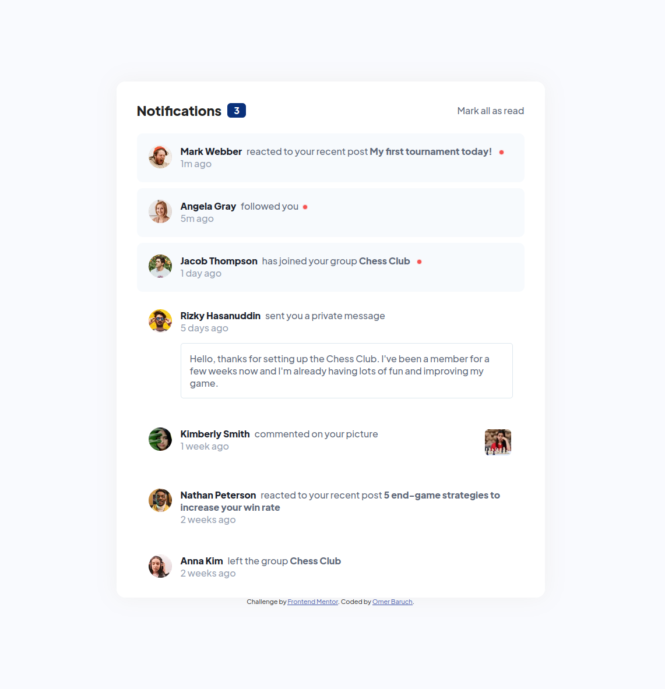
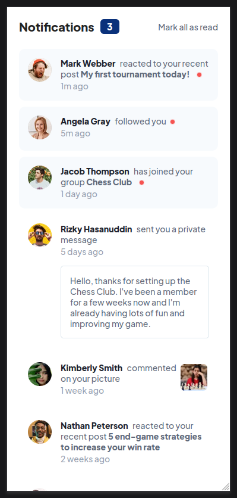
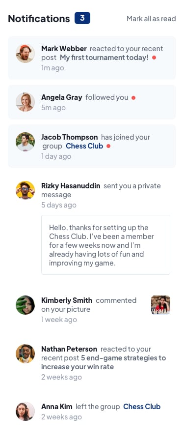

# Frontend Mentor - Notifications page solution

This is a solution to the [Notifications page challenge on Frontend Mentor](https://www.frontendmentor.io/challenges/notifications-page-DqK5QAmKbC).

## Table of contents

- [Overview](#overview)
  - [The challenge](#the-challenge)
  - [Screenshot](#screenshot)
  - [Links](#links)
- [My process](#my-process)
  - [Built with](#built-with)
  - [What I learned](#what-i-learned)
    - [HTML](#html)
    - [CSS](#css)
    - [JavaScript](#javascript)
    - [Git](#git)
  - [Continued development](#continued-development)
  - [Acknowledgments](#acknowledgments)
- [Author](#author)

## Overview

The challenge here was to create a notifications page from scratch while matching both the challenge requirements and the design specs below. I've also included a few extras that were not in the challenge specs:
- Add links to the profile pictures
- Add behavior to mark individual notifications as read by clicking on any link in the notification
- Add behavior to reduce the unread notifications number when clicking on any links within an unread notification

### The challenge

Users should be able to:

- Distinguish between "unread" and "read" notifications
- Select "Mark all as read" to toggle the visual state of the unread notifications and set the number of unread messages to zero
- View the optimal layout for the interface depending on their device's screen size
- See hover and focus states for all interactive elements on the page

### Screenshot







### Links

- Solution URL: [Add solution URL here](https://github.com/odbaruch/notifications-project)
- Live Site URL: [Add live site URL here](https://notifications-project.vercel.app/)

## My process

### Built with

- Semantic HTML5
- CSS
- Flexbox
- JavaScript

### What I learned

#### HTML

Semantic HTML concepts: I started out by using as many semantic elements as I could and then paring them down when they were unnecessary. For example, I originally had the heading wrapped in `<header>` tags and the body of the notifications wrapped in a `<section>`.  
Upon further reading into the use of these tags, I concluded that they would be confusing to a screen reader as they separate the body of the notifications from their context which is provided by the heading.  
I settled on wrapping the entire section in a `<main>` tag and separating out the heading and body using `<div>` tags:  
```
<body>
  <main>
    <div class="notifications-heading">
      <h1 class="notifications-title">
        Notifications
      </h1>
      <div class="notifications-number" id="notifications-number">
        3
      </div>
      <button class="notifications-read" type="button" onclick="clearNotifications()">
        Mark all as read
      </button>
    </div>
    <div class="notifications">
      <div class="notification-card unread">
        <div class="profile-picture-section">
          
        </div>
        <div class="notification-text-section">
          <p class="notification-text">
            <a class="name" href="#">Mark Webber</a> reacted to your recent post <a class="post" href="#">My first tournament today!</a>
            <span class="notification-text-dot"></span>
          </p>
          <time class="notification-timestamp">1m ago</time>
        </div>
      </div>
```

#### CSS

Use of HSL color: this was my first interaction with HSL color values. While I still prefer hex colors for their readability, I now have a better understanding of the usefulness of HSL when trying to match a design spec exactly.  

Image borders: preventing a border from resizing its parent element on hover/focus without resizing the content was not something I had encountered before. I found a neat trick to accomplish this - adding a transparent border to the image to claim the space and only changing the border color on hover/focus:  

``` 
.notification-image {
    width: 45px;
    box-sizing: content-box;
    border: 3px solid transparent;
    transition: all 0.15s ease;
}
.notification-image-link:hover .notification-image, .notification-image-link:focus .notification-image {
    border: 3px solid hsl(205, 33%, 90%);
    border-radius: 10px;
}
```

#### JavaScript

The `querySelectorAll()` method: this was my first time using this method and I expect I'll be using it frequently in the future. I used this method both to select elements in the DOM which I wanted to change and to perform the unread notifications number calculation. I'm particularly proud of my solution to decrement the unread notifications number by counting the elements with an `.unread` class:  

```
// Selecting DOM elements
const notificationsNumber = document.querySelector(".notifications-number");
const unreadNotifications = document.querySelectorAll(".unread");
const notificationLinks = document.querySelectorAll(".name, .group, .post, .notification-message, .notification-image, .profile-picture");

// Unread notifications calculation
var unreadNumber = document.querySelectorAll(".unread").length;
notificationsNumber.innerHTML = unreadNumber;
```

The `closest()` method: I was looking for a way to modify the parent notification card elements when any of their child links were clicked and happened upon this method which did exactly what I wanted:

```
// Remove class from parent element when any child links were clicked
notificationLinks[i].closest(".notification-card").classList.remove("unread");
```

#### Git

While I was already familiar with Git, I ran into an issue where I was being asked to input my personal access token for every push. This lead to my discovering [Git Credential Manager](https://github.com/GitCredentialManager/git-credential-manager).  
As part of its configuration, I learned how to generate GPG keys and add them to my Github account, and how to configure Git to use custom credential stores.

### Continued development

While I included `<time>` tags in my project, I did not include any `datetime` attributes in the tags as this was well outside the scope of this challenge. Going forward, I would like to learn how to add these programatically and then calculate the "1 day ago"/"1 week ago"/"Last week" values displayed in the DOM.

### Acknowledgements

- [u/FreakCERS](https://www.reddit.com/r/css/comments/5gqpi5/prevent_cell_resize_when_adding_a_border_to_it/) for the image border trick to prevent resizing on hover/focus
- [the8472](https://stackoverflow.com/questions/22119673/find-the-closest-ancestor-element-that-has-a-specific-class) for the `closest()` method
- [Gibolt](https://stackoverflow.com/questions/28610365/how-can-i-add-an-event-for-a-one-time-click-to-a-function) for the `{once : true}` Boolean


## Author

Omer Baruch
- Github - [odbaruch](https://github.com/odbaruch)
- Frontend Mentor - [@odbaruch](https://www.frontendmentor.io/profile/odbaruch)